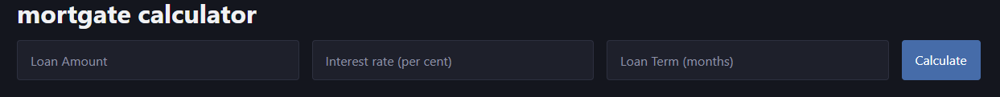

---
date:
    created: 2025-04-13
    updated: 2025-04-15
authors:
    - xy
categories: 
    - Tutorial
tags:
    - dev tools
slug: mortgate
---

# Build a mortgate calculator with fasthtml
<!-- more -->

There are app frameworks out there for domain experts to easily get started with app buiding, e.g. `streamlit` for data scientists. 

A possible downside of these approaches is the lack of flexibility and scalability. [`fasthtml`](https://www.fastht.ml/) is a new python framework that is flexible and,  from what I read, pretty scalable too. It provides a unified python interface that maps 1-to-1 to HTTP, html, and htmx for interactivity. This guarantees flexibility without unnecessary abstractions and minimizes client side logic. Also the code often looks pretty neat, therefore temping for new users to get started by copy-pasting some basic examples from their repo. 

That said, if a new user does not have any knowledge of the web (eg http, how anchor/form tags work, client-server communication, htmx attributes), there are concepts to learn before they can make sense of the framework. But these concepts are worth learning anyway for someone building a web app, so the time invested in the learning is not wasted.  

Here is a toy example.





The whole app is one python file with 20 lines of code (see below). Features highlighted: 

- html tags are python object (title, input, button, div, details).
- router and function names map to  url and http methods (put, get ...).
- htmx for (server centric) interactivity, avoiding writing too much javascript (hx_include, hx_put) 
- by default pico css is used for styling (it can be swapped by tailwind via `monsterui`, or customized css)

```py
from fasthtml.common import *

app, rt = fast_app(pico=True) # default True

@rt("/")
def get():
    return Titled("mortgate calculator", 
        Grid(
            Input(type="number", placeholder="Loan Amount", id="P"),
            Input(type="number", placeholder="Interest rate (per cent)", id="r"),
            Input(type="number", placeholder="Loan Term (months)", id="n"),
            Button("Calculate", target_id="result", hx_put="/calculate", hx_include="#P,#r,#n"),),
        Div(id="result")
    )

@rt("/calculate")
def put(P:float,r:float,n:int):
    r= r/ 100 / 12
    m = P*r*(1+r)**n / ((1+r)**n - 1)
    return Details(
        Summary(H3(f"monthly payment {m:.2f}")), 
        Ul(Li(f"interest payment {P*r:.2f}"), Li(f"principle payment {m-P*r:.2f}")),
        open=True)

serve()
```

No form element is used because *any* html element is allowed (via htmx) to trigger HTTP requests. The payload picks up the values of the ids mentioned in `hx_include` attribute (equivalent to using a form which wraps the inputs and button). 
