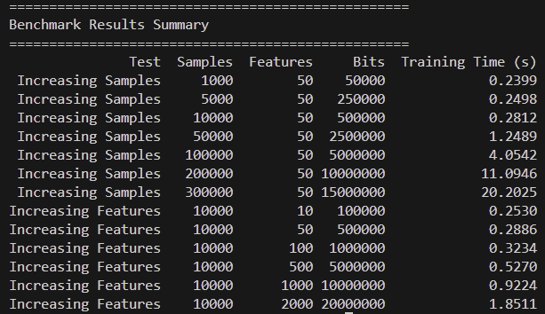

# Random forest scaling mini-benchmark
<!-- more -->
My goal in this minibench is to see how random forest models scale with the sample size/feature size.

I run the script at the end of this post on my Intel i5-10400 6 cores + 8GB RAM machine. I cannot scale sample size any larger i.e. 400k rows with this hardware. 

Software side, I have scikit-learn=1.7 and numpy=2.2.5 running on python3.12

Here is the result 




Two observations

- it is easier to scale the feature number than to scale the sample size
- there is some sort of crossover regime change in that 2x sample size requires 3x or more training time at larger sample size, something that is not happening when the sample size is small. 


```py
import time
import numpy as np
from sklearn.ensemble import RandomForestClassifier
import pandas as pd

def generate_data(n_samples, n_features):
    print(f"Generating data: {n_samples} samples, {n_features} features...")
    X = np.random.randint(2, size=(n_samples, n_features))
    y = np.random.randint(2, size=n_samples)
    return X, y

def benchmark_training(X, y):
    model = RandomForestClassifier(n_estimators=100, random_state=42, n_jobs=-1)
    start_time = time.time()
    model.fit(X, y)
    end_time = time.time()
    return end_time - start_time

def run_benchmarks():
    results = []

    print("-" * 50)
    print("Benchmark 1: Increasing Number of Samples (Rows)")
    print("-" * 50)
    n_features_fixed = 50
    sample_sizes = [1000, 5000, 10000, 50000, 100000, 200000, 300000]

    for n_samples in sample_sizes:
        try:
            X, y = generate_data(n_samples, n_features_fixed)
            training_time = benchmark_training(X, y)
            results.append({
                "Test": "Increasing Samples",
                "Samples": n_samples,
                "Features": n_features_fixed,
                "Bits": n_samples * n_features_fixed,
                "Training Time (s)": round(training_time, 4)
            })
            del X, y
        except MemoryError:
            print(f"MemoryError at {n_samples} samples. Stopping this benchmark.")
            break

    print("\n" + "-" * 50)
    print("Benchmark 2: Increasing Number of Features (Columns)")
    print("-" * 50)
    n_samples_fixed = 10000
    feature_sizes = [10, 50, 100, 500, 1000, 2000]

    for n_features in feature_sizes:
        X, y = generate_data(n_samples_fixed, n_features)
        training_time = benchmark_training(X, y)
        results.append({
            "Test": "Increasing Features",
            "Samples": n_samples_fixed,
            "Features": n_features,
            "Bits": n_samples_fixed * n_features,
            "Training Time (s)": round(training_time, 4)
        })
        del X, y

    print("\n" + "=" * 50)
    print("Benchmark Results Summary")
    print("=" * 50)
    df_results = pd.DataFrame(results)
    print(df_results.to_string(index=False))


if __name__ == "__main__":
    run_benchmarks()

```
