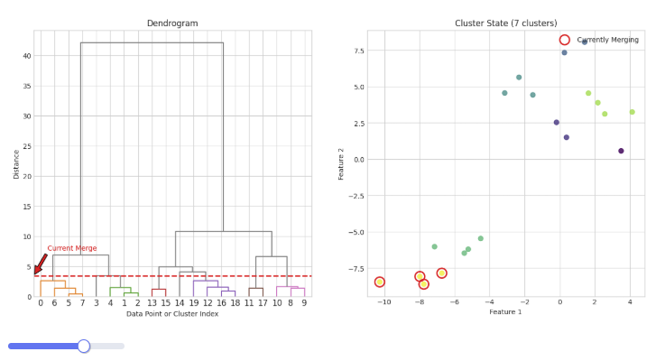

# Hierarchical clustering with 36 LOC

<!-- more -->
Clustering is the action of dividing samples into subgroups. 

Hierarchical clustering is a bottom up method that gradually merge individual samples into bigger groups until all samples are merged into one group. The criterion for the merge is distance-based. For example, the single linkage algorithm merges clusters that are closest to each other where the distance between clusters is measured using Euclidean distance between sets. 

The abundant choice of distance functions lead to a zoo of HC algorithms, but the idea is the same. 

For example we have 5 samples indexed by 1, ..., 5. Each sample is a cluster of its own in the beginning. Let's say 1 and 3 are the closest among all pairs. We merge them and obtain clusters {1,3}, {2}, {4}, {5}. Then we compute the inter-cluster distance and, say, find the closest ones to be {1,3} and {2}.  We merge them to obtain clusters {1,2,3}, {4}, {5}. We repeat this process until there is only one cluster {1,2,3,4,5}. 

It is up to the user of the algorihm to decide the number of clusters needed for the problem at hands. Say the user wants 2 clusters, then they can use the 2 clusters just before the last merge. If they want 3 clusters, they can stop before the one but last merge, etc etc.

Hopefully the idea is clear. Let's see how to implement it. We need to keep track of two things (in fact three, hold on for a second for the explanation):

- current cluster structure (a partition if you wish)
- current inter-cluster distances

For the first, we can use a hashmap `dict[int, set]` where the key is the index of cluster, and the value is the collection of samples indices beloging to that cluster. 

For the second, we can use a heap (priority queue) so that the retrieval of minimum distance and its update is fast. For faster computation of inter-cluster distance, it is actually beneficial to have a copy of the distances stored as a hashmap too (hence 3 things to maintain). 

In summary, here's the plan of attack. 

Initialization: 

- define each individual as one cluster 
- compute pairwise distances and store them in a heap and a hashmap

Main loop:

1. retrieve smallest distance
1. merge: update clusters hashmap
1. compute distances: update distances heap and hashmap

Here is all the code. Also a few comments just below. 

```py
import math 
import heapq

def euclid(u,v):
    return math.sqrt(sum((ui-vi)**2 for ui,vi in zip(u,v)))

def init(arr):
    """space O(m^2)"""
    m = len(arr)
    clusters = {i:{i} for i in range(m)}
    dmap = {(i,j): euclid(arr[i],arr[j])
        for i in range(m-1)
        for j in range(i+1,m)
    }
    dheap = [(d,i,j) for (i,j), d in dmap.items()]
    heapq.heapify(dheap)
    return clusters, dmap, dheap

def main(arr, low):
    """time O(m^2 log m)"""
    clusters, dmap, dheap = init(arr)
    res = []
    while len(clusters)>low:
        # retrieve smallest
        while True: 
            d, i, j = heapq.heappop(dheap)
            if i in clusters and j in clusters:
                break
        res.append((d,i,j))
        # update clusters: + 1 - 2
        new_idx = max(clusters) + 1
        clusters.update({new_idx: clusters[i].union(clusters[j])})
        clusters.pop(i)
        clusters.pop(j)
        # compute distance
        for k in clusters:
            if k != new_idx:
                # update dmap O(1)
                dmap[(k,new_idx)] = newtok = min(
                    dmap[tuple(sorted([i,k]))],  
                    dmap[tuple(sorted([j,k]))]
                )
                # udpate dheap O(log m)
                heapq.heappush(dheap,(newtok,k,new_idx))
    return clusters, res
```


## Why heap? 

A heap is a complete binary tree (stored in a sequence by arithmetic mapping between nodes and index). In python `heapq` implements the min heap which means that the root is the smallest element and 
all parent node is smaller than the children nodes. The retrival of smallest element is O(1) operation. 

A heap must be dynamically maintained with the insertion and deletion of elements.
Since the height of a complete binary tree is O(log n) for a tree with n elements, the cost of maintain the min heap structure when inserting (push) new element to the heap or removing (pop) smallest element is O(log n) (because an update is basically a chain of swapping operations between parent and child node, upwards / downwards). 

The python module `heapq` is in the stdlib with a simple API. To pop an element from the root: 

```py
heapq.heappop(dheap)
```

To push a new element into the heap:

```py
heapq.heappush(dheap, element)
```

At initialization, one can turn a list into a heap all at once with O(n) time instead of push one by one which would require O(n log n) time

```py
heapq.heapify(my_list)
```

## Merge

Notice that we mint a new index for the merged cluster, which becomes the hash key. 


## Inter-cluster distance

This is where different algorithms vary. What we have implemented is the single linkage algorithm.  

```py
dmap[(k,new_idx)] = min(
    dmap[tuple(sorted([i,k]))],  
    dmap[tuple(sorted([j,k]))]
)
```

The  complete  linkage algorithm amounts to take max instead of min in the above. Each choice has its own trade-off and focus. 


## Main loop

The first while loop is simple: we merge one at a time until we reach `low` number of clusters.


The inner while loop is necessary becasue when a merge happens, the old cluster index is removed from 
`clusters` but they still exists in `dheap`. We keep removing them until we get both indices in the current `clusters` (as keys). 

The purpose of the for loop is to push distances of the new cluster with other clusters into `dheap`, as well as the `dmap`. 

## Demo 

Here is an [interactive demo](https://marimo.app/l/kfj58s). You can activate the app mode by pressing (Ctrl+ .) 
The visualization is generated one-shot by Gemini 2.5 pro. 



The source is [here](https://github.com/xiaochuany/etudes/blob/main/ml-from-scratch/hierarchical.py) in case the link is not valid any more when you read this post. 