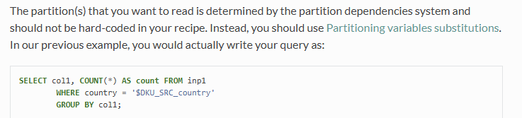
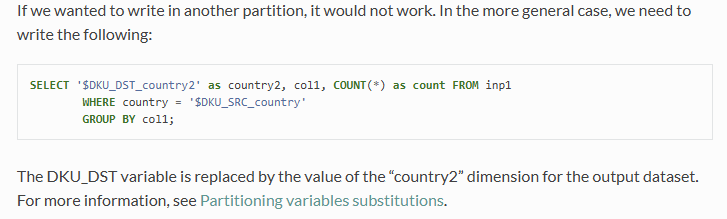
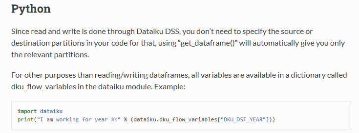

# Use code when Dataiku's UI gets in the way

<!-- more -->

## Feed partition numbers with code

To programmatically feed partition numbers, do

```py
import dataiku as dk
p = dk.api_client().get_project("MYPROJECT")
p.get_recipe("MYRECIPE").run(partitions=...)
```

This is particularly useful when the UI cannot autocomplete the partition keys (e.g. discrete values), but it is trivial to 
write a python function/SQL query to retrive them. Also possible is to use the grammer for partition identifiers:

https://doc.dataiku.com/dss/latest/partitions/identifiers.html

Another way of doing it is through Job object. There are more configs which can be useful. 

https://developer.dataiku.com/latest/concepts-and-examples/jobs.html
https://developer.dataiku.com/latest/api-reference/python/projects.html#dataikuapi.dss.project.DSSProject.list_jobs

## Access custom variables

There are several possible ways of accessing variables. For me, the one in the dataiku namespace is best for the ease of use

```py
import dataiku as dk

dk.get_custom_variables() 
```

Indeed, although one gets the project level variables like this 

```py
dk.api_client().project("MYPROJECT").get_variables()
```

the returned object is a nested dictionary, with standard variables dict and local variables dict inside it. 

As far as I can tell, `dk.get_custom_variables` has everything in it, containing both standard and local variables, and it is a flat dictionary. I prefer this one over the project-level variables dict. 


Yet another kind of variables are runtime variables. If we call the below in a notebook we get `None`. It may come in handy in a SQL/Python recipe and can be used to refer to a column that is the partition key (be it in the input table or the ouput table). 

```py
dk.dku_flow_variables # dict
```

## SQL **recipe** that takes as input a partitioned dataset 



if I want to partition the output on a column that is not necessarily the input partition key



## Python **recipe** that takes as input a partitioned dataset 



more rules about partition variable substitution

https://doc.dataiku.com/dss/latest/partitions/variables.html


## Partition dependency function 

Haven't use it in my projects but I can see it being flexible in specifying the dependency of input and output partitions. 

https://doc.dataiku.com/dss/latest/partitions/dependencies.html
