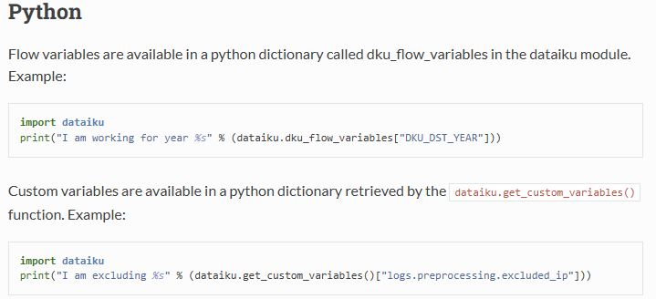
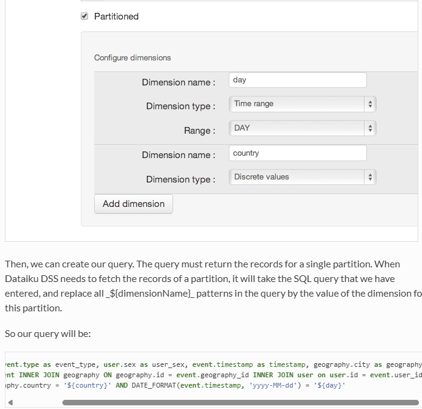
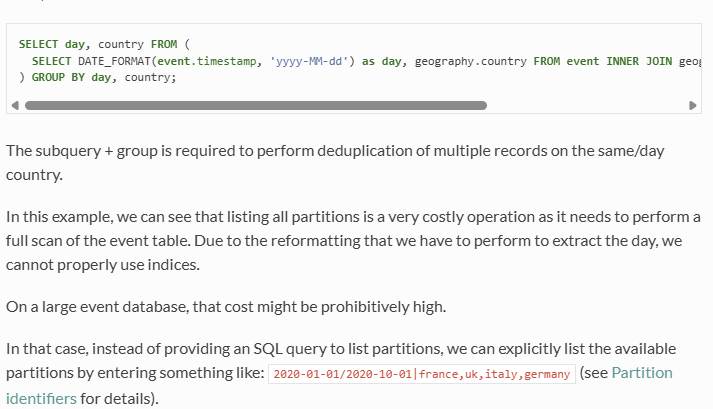

# dataiku productivity patterns
<!-- more -->


## Feed partition numbers with code

To programmatically feed partition numbers, do

```py
import dataiku as dk

p = dk.api_client().get_project("MYPROJECT")
p.get_recipe("MYRECIPE").run(partitions=...)
```

This is particularly useful when the UI cannot autocomplete the partition keys (e.g. discrete values).  

https://developer.dataiku.com/latest/concepts-and-examples/projects.html
https://developer.dataiku.com/latest/api-reference/python/projects.html#dataiku.Project


https://developer.dataiku.com/latest/concepts-and-examples/recipes.html
https://developer.dataiku.com/latest/api-reference/python/recipes.html

Seems possible to use the concept of jobs

https://developer.dataiku.com/latest/concepts-and-examples/jobs.html
https://developer.dataiku.com/latest/api-reference/python/projects.html#dataikuapi.dss.project.DSSProject.list_jobs

## Access custom variables

```py
import dataiku as dk

dk.get_custom_variables() 
```

there is also the project level variables 

```py
dk.api_client().project("MYPROJECT").get_variables()
```

but the latter one is a nested dictionary, with standard and local saved as separate dicts inside the dict returned by the method above. 

As far as I can tell, `dk.get_custom_variables` has everything in it, both standard and local, and it is a flat dictionary. 
Prefer this over using the project level variable handle. 


Yet another kind of variables are runtime variables. If we call this in a notebook it is empty. It figures in a SQL/Python recipe and can be used to refer to a column that is the partition key. 

```py
dk.dku_flow_variables 
```
Examples from the official docs. More details see below. 




## public API

https://developer.dataiku.com/latest/tutorials/devtools/public-api-intro/index.html


##  partition SQL query **dataset** and provide partition identifiers (or write a query to retrieve them): 





grammer for partition identifiers

https://doc.dataiku.com/dss/latest/partitions/identifiers.html

## SQL **recipe** that takes as input a partitioned dataset 


if I want to partition the output on a  columns that is not necessarily the input partition key


## Python recipe that takes as input a partitioned dataset 


more rules about partition variable substitution

https://doc.dataiku.com/dss/latest/partitions/variables.html


## partition dependency function 

https://doc.dataiku.com/dss/latest/partitions/dependencies.html
