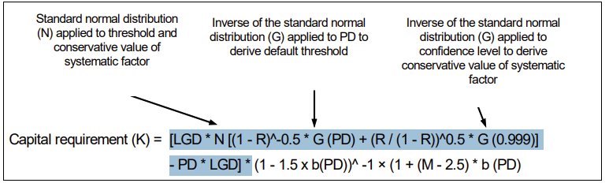

# Vasicek in Basel
<!-- more -->

> be me  
> be Vasicek  
> chill Czech dude  
> decide to model credit risk with Brownian motion  
> invent one-factor Gaussian copula before it was cool  
> "default happens when latent variable crosses threshold"  
> everyone claps  

> fast-forward  
> Basel Committee steals my idea  
> slaps some capital requirement on it  
> banks now simulating millions of standard normals  
> get no royalties

> Merton out here pricing corporate debt with structural models  
> I just make it rain closed-form expressions  
> still gets all the fame  

> Moody’s KMV be like “thanks for the latent variable bro”  
> turn it into a product  
> banks pay millions  
> I get academic citation  

> still better than being Black or Scholes  
> at least nobody’s blowing up hedge funds with my model  
> yet.  

This post is not about Vasicek's life. It is about a legacy Vasicek left for the banking regulations.

## Capital requirement

The above formula figures in the Basel framework for regulatory capital computation. You see the Gaussian distribution function, the probability of default, the correlation of obligors's asset value with a common factor for all obligors such as economic situation.

Where is this coming from?   

!!! reference

    http://mx.nthu.edu.tw/~jtyang/Teaching/Risk_management/Papers/Models/Probability%20of%20Loss%20on%20Loan%20Portfolio.pdf

    https://www.bankofgreece.gr/MediaAttachments/Vasicek.pdf

## One factor model

Capital is required to cover unexpected loss. Mathematically, the expected loss just means the expectation of the loss of a portfolio of instruments. The regulatory unexpected loss can be roughly translated to the difference between the quantile of the loss distribution and the expected value of the loss.

The one factor model postulates the following, the asset value of obligor $i$ is the 

$$
A_i = \sqrt{\rho} X + \sqrt{1-\rho} \epsilon_i
$$

where $(X,\epsilon_i, i=1,2,...)$ is iid Gaussian standard normal, and $X$ represents the common factor that influences the value of all assets. Notice that $(A_i)$ are standard Gaussian correlated with correlation $\rho$.  

Default event occurs if the asset value falls below a certain threshold $B_i$. The probability of default given $X$ is therefore

$$
P[A_i< B_i|X] = \Phi(\frac{B_i -\sqrt{\rho}X}{\sqrt{1-\rho}})
$$

where $\Phi$ is the CDF of a standard Gaussian. 

In real life, the (unconditional) probability of default may come from an internal model (say a logistic regression on obligor characteristics), denoted by $(p_i)$

$$
p_i = P[A_i<B_i]
$$

namely 

$$
B_i  = \Phi^{-1}(p_i).
$$

 
## Law of large numbers 

When the number of obligors in a portfolio is large, the law of large numbers kicks in,

$$
P\Big[\frac{1}{n}\sum_{i=1}^n I(A_i<\Phi^{-1}(p_i)) \to 
\Phi(\frac{B_i -\sqrt{\rho}X}{\sqrt{1-\rho}})|X
\Big] =1
$$

Assume that the loss incured by a default event is 1/n across all obligors in the portfolio, then the loss
is 

$$
L = \frac{1}{n}\sum_{i=1}^n I(A_i<\Phi^{-1}(p_i)) \approx 
\Phi(\frac{\Phi^{-1}(p_i) -\sqrt{\rho}X}{\sqrt{1-\rho}}).
$$

## Quantile of the loss

We show that 

$$
q_{L,\alpha} \approx \Phi(\frac{\Phi^{-1}(p_i) - \sqrt{\rho} q_{X,1-\alpha}}{\sqrt{1-\rho}})
$$

where  $q_{D,\alpha}$ is the $\alpha$ quantile of random variable $D$, therefore $q_{X,1-\alpha} = \Phi^{-1}(1-\alpha)= -\Phi^{-1}(\alpha)$. The Basel formula follows right off with $\alpha = 0.999$. 
 
Indeed, we are interested in the 0.999 quantile of $L$ which is approximately a monotone function of the Gaussian $X$. Using the approximation, we have 

$$
\begin{align*}
0.999 = P[L\le q] & \approx P[\Phi(\frac{\Phi^{-1}(p_i) -\sqrt{\rho}X}{\sqrt{1-\rho}})\le q] \\
& = P\Big[X\ge \frac{\Phi^{-1}(p_i) - \sqrt{1-\rho} \Phi^{-1}(q)}{\sqrt{\rho}}\Big] \\
&= 1 - \Phi( \frac{\Phi^{-1}(p_i) - \sqrt{1-\rho} \Phi^{-1}(q)}{\sqrt{\rho}})
\end{align*}
$$

Rearranging terms

$$
\Phi^{-1}(q) = \frac{ \Phi^{-1}(p_i) - \sqrt{\rho}\Phi^{-1}(0.001)  } {\sqrt{1-\rho} }.
$$

Hence,

$$
q = \Phi(\frac{\Phi^{-1}(p_i)+\sqrt{\rho}\Phi^{-1}(0.999)}{\sqrt{1-\rho}})  
$$

as desired. 

