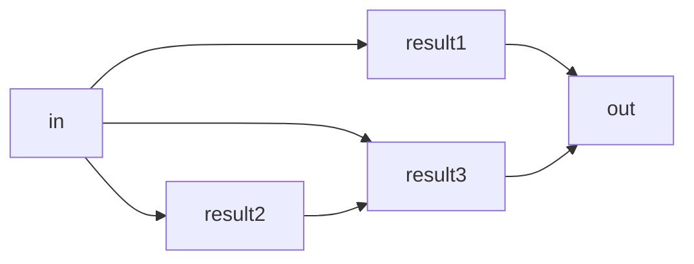

# Essentials of `polars` 

What does a dataframe library do? A few things come to mind. 

- join/merge
- group by
- aggregation
- windows function
- rolling windows
- ...

There are a plethora of dataframe libraries in python, `polars` seems to me a clear winner in the game of "finding the successor of `pandas`". 

Born in 2020, `polars` released its version 1.0 in mid-2024,
officially marking its production readiness. 
A popular saying about `polars` is that people "came for the speed, stay for the syntax". 
The API design of `polars` emphasizes parallelisation and composability, which I find both intuitive and expressive.  

The goal of this tutorial is to present some basic concetps for effective use of the library.

## Eager vs Lazy

A key concept that differentiates `polars` from `pandas` is its "lazy execution".
Think about this query in the diagram where the input `in` is processed in some ways
to achieve the result `out`.



**Eager execution** means that data operations are executed sequentially,
one after another as user's query, with all the data load into memory and intermediate results stayed in memory. This is both wasteful and inefficient. 

**Lazy execution** would mean an abstract execution of opeations without actually loading 
the data into memory until the user explicitly requests it. Think of this as composition of functions where no input is required (the schema of the input, not the values, must be known upfront). 
The lazy execution model leaves the possibility of optimising user's query by changing the order of certain operations, fusing them, and all sorts of smart tricks that can boost the computation efficiency when data is eventually fed. This is very similar to machine learnig compilers would do (think `torch.compile` and `jax.jit`).


`pandas` only operates in eager mode, while `polars` operates on both. The eager API is useful in developement because of its explicitness, while the lazy API useful in production because of its efficiency. The lazy API of `polars` is almost identical to the eager one so there is little mental overhead to users. 

## Parallelism

`polars` embraces parallelism whenever possible. Also, thanks to the Expression API, commands run in parallel are easy to guess/reason about. 

Take a look at the dependency graph of our mock query again. All the intermediate results depend on the input `in`. Would it be good if these steps run in parallel? Yes, and this is exactly what `polars` would do. 

## Expression

So far we've only discussed some design choices. `polars` offers an Expression API that aligns with these design choices.
An expression is a function which associates in 1d array (think: a column in a dataframe) and spits out a 


!!! note "Users new to DataFrames"
    A DataFrame is a 2-dimensional data structure that is useful for data manipulation and analysis. With labeled axes for rows and columns, each column can contain different data types, making complex data operations such as merging and aggregation much easier. Due to their flexibility and intuitive way of storing and working with data, DataFrames have become increasingly popular in modern data analytics and engineering.


```py exec="on" source="above" result="1"
-8<- "new.py"
```