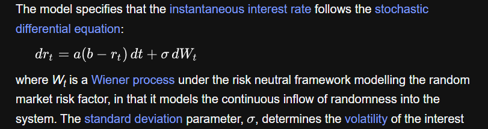
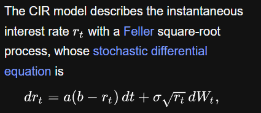

# diffusions 

short curve models

## vasicek one factor

## hull-white

## cox-ingersoll-ross

## fundamental theorem 

lecture notes Lalley

https://galton.uchicago.edu/~lalley/Courses/390/Lecture1.pdf

## forward curve models

heath jarrow morton

## jump diffusion OU

## implied volatility modeling

## regulations 

2025 ECB guide for internal models 370p

https://www.bankingsupervision.europa.eu/ecb/pub/pdf/ssm.supervisory_guide202507.en.pdf

2019 instruction for model validation 70p

https://www.bankingsupervision.europa.eu/activities/internal_models/shared/pdf/instructions_validation_reporting_credit_risk.en.pdf

EBA/GL/2017/16: guidelines on pd estimation ...

https://www.eba.europa.eu/documents/10180/2192133/f5a2e068-dc4b-4a0e-a10f-378b517ac19c/Guidelines%20on%20PD%20and%20LGD%20estimation%20(EBA-GL-2017-16)_EN.pdf
